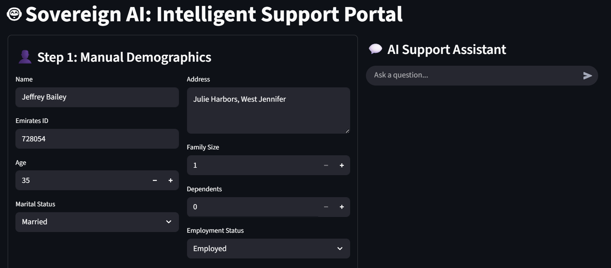
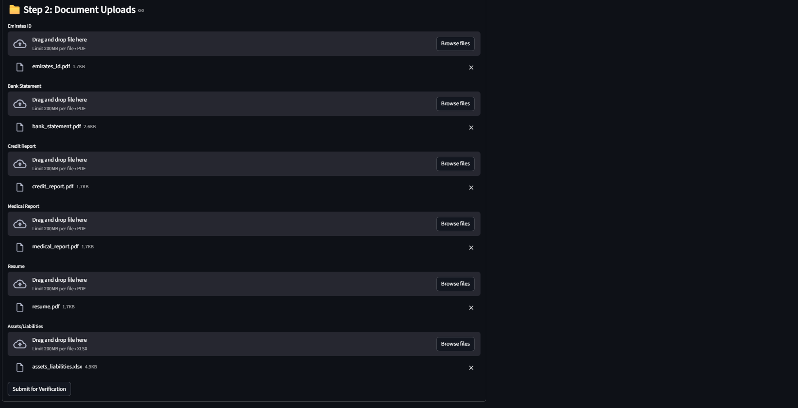
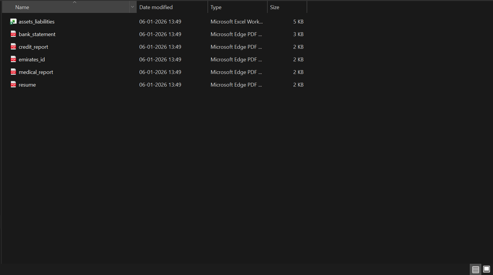
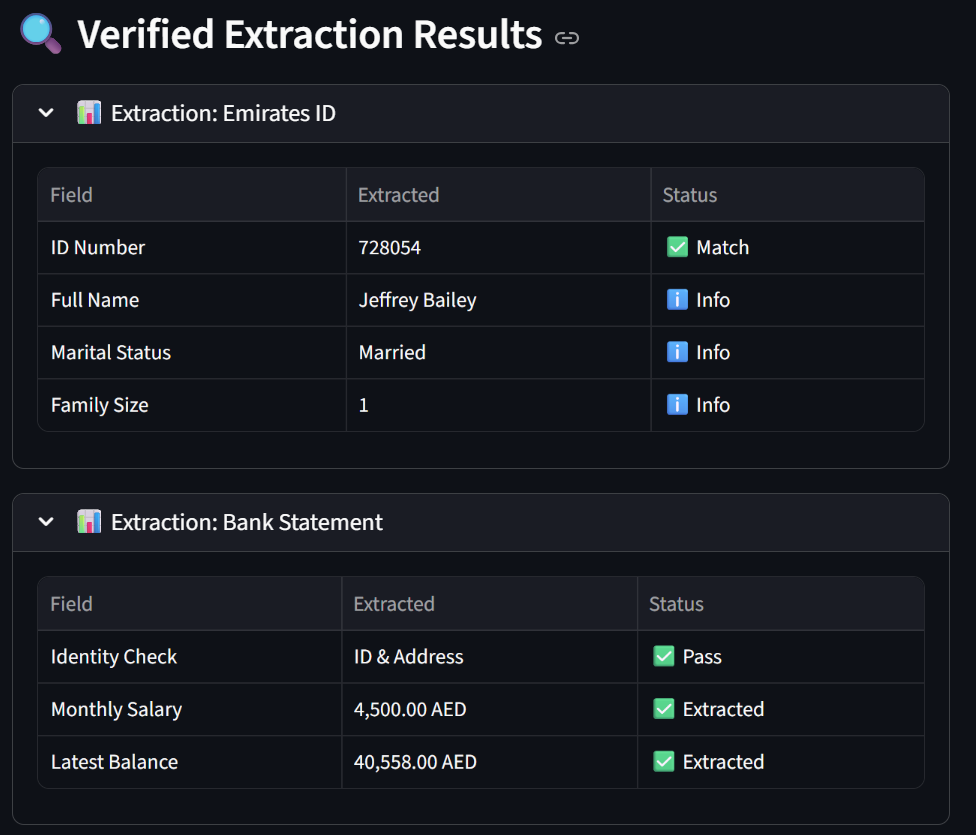
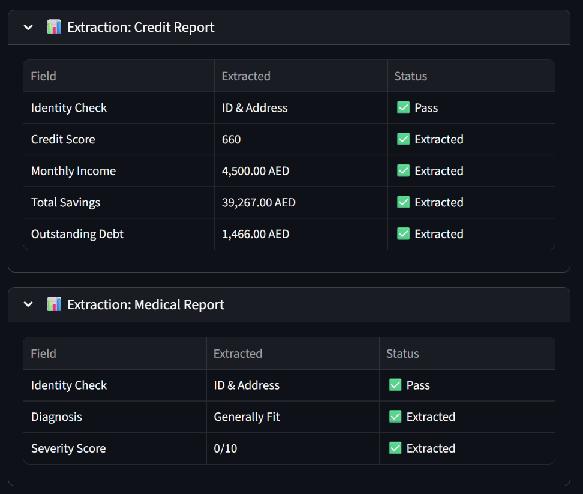
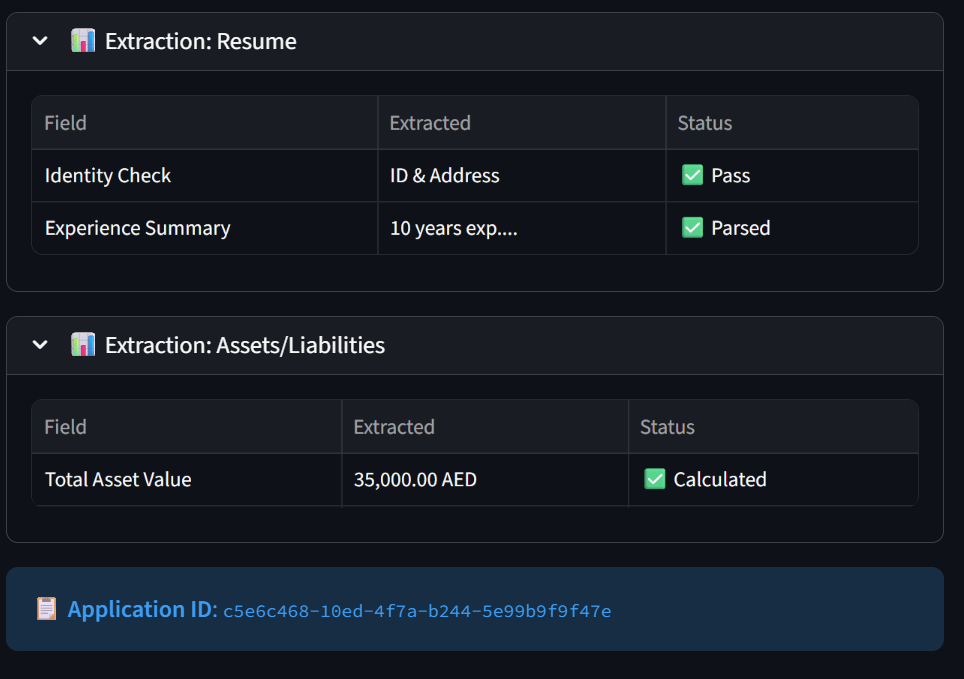
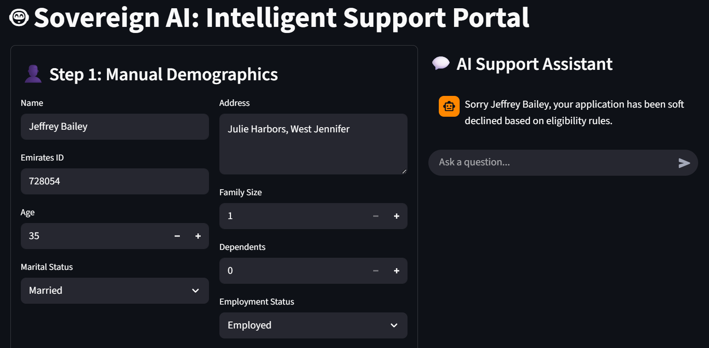
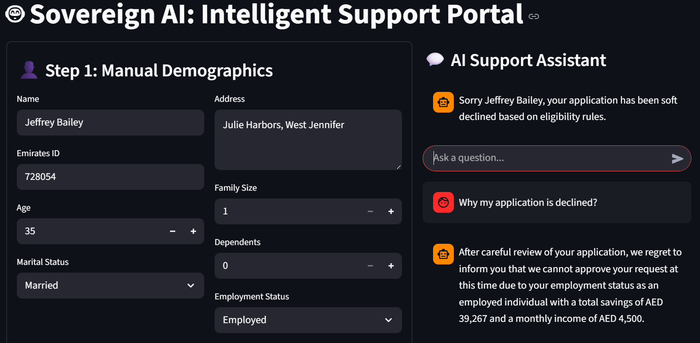

# SOVEREIGN AI: AUTONOMOUS SOCIAL SUPPORT VERIFIER
## Quick Start & User Guide

---

## 📋 Table of Contents
1. User Interface Walkthrough
2. Document Upload Guide
3. Extraction Results
4. Application Decision
7. Troubleshooting

---

## 📱 User Interface Walkthrough

### Step 1: Fill Applicant Demographics

When you launch the application, you'll see the main interface on the left side with the heading **"Step 1: Manual Demographics"**.



**Fields to Fill:**
- **Name**: Full name of the applicant
- **Emirates ID**: Valid 6-15 digit Emirates ID
- **Age**: Applicant's age (use +/- buttons or type)
- **Address**: Full residential address
- **Marital Status**: Select from dropdown (Single, Married, Divorced, Widowed)
- **Family Size**: Number of family members (use +/- buttons)
- **Dependents**: Number of dependent children (use +/- buttons)
- **Employment Status**: Select from dropdown (Employed, Self-Employed, Unemployed, Retired)

### Step 2: Document Upload

Scroll down to the **"Step 2: Document Uploads"** section.



**Documents Required:**

You need to upload the following documents as PDF or Excel files. All documents must be valid and contain applicant information.

---

## 📁 Document Upload Guide

### Required Documents & File Format



| Document Type | Format | File Size | Description |
|---------------|--------|-----------|-------------|
| **Emirates ID** | PDF | < 200MB | Official identification document with ID number, name, and family information |
| **Bank Statement** | PDF | < 200MB | Monthly bank statement showing salary deposits and account balance |
| **Credit Report** | PDF | < 200MB | Credit report containing credit score, income, and savings information |
| **Medical Report** | PDF | < 200MB | Medical diagnosis and severity assessment (if applicable) |
| **Resume** | PDF | < 200MB | Employment history and work experience documentation |
| **Assets/Liabilities** | XLSX (Excel) | < 200MB | Spreadsheet listing all assets and their estimated values |

### Uploading Files

**Method 1: Drag and Drop**
- Drag and drop each file into the designated upload area

**Method 2: Browse Files**
- Click the "Browse Files" button
- Select the file from your computer
- File will appear in the upload area


### After Uploading All Documents

Once all 6 documents are uploaded, click the **"Submit for Verification"** button.

The system will:
1. Extract data from each document
2. Validate consistency across documents
3. Run ML eligibility prediction
4. Generate AI-powered decision reasoning
5. Display results below

---

## 📊 Extraction Results

As the system processes your documents, scroll down to see the **"Verified Extraction Results"** section. The system will display extracted information from each document.

### Emirates ID Extraction



**Information Extracted:**
- ID Number (verified against submitted ID)
- Full Name (must match across documents)
- Marital Status
- Family Size (cross-validated)

**Status Indicators:**
- ✅ **Match** - Field matches submitted information
- ℹ️ **Info** - Informational field extracted
- ❌ **Fail** - Field extraction or validation failed

---

### Bank Statement Extraction



**Information Extracted:**
- Identity Check (ID & Address verification)
- Monthly Salary (first SALARY TRANSFER amount captured)
- Latest Account Balance

**Validation:**
- Income consistency checked against Credit Report (±500 AED threshold)
- All amounts in AED currency

---

### Credit Report & Additional Documents Extraction



**Information Extracted from Credit Report:**
- Credit Score
- Monthly Reported Income
- Total Savings
- Outstanding Debt

**Information from Other Documents:**
- **Medical Report**: Diagnosis and Severity Score (0-10)
- **Resume**: Work experience summary
- **Assets/Liabilities**: Total asset value calculation

**All extractions are validated for:**
- ✅ Identity consistency across documents
- ✅ Income harmony (salary vs. reported income)
- ✅ Family size consistency
- ✅ Data accuracy and completeness

---

## 🎯 Application Decision

### Decision Output

Once all documents are processed and verified, scroll to the **"AI Support Assistant"** panel on the right side to see the final decision.



**Decision Types:**

#### ✅ ACCEPTED
```
"Congratulations [Name], your application is accepted."
```
- Application meets all eligibility criteria
- You will receive information about support options
- Recommendation Agent will suggest appropriate support pathway

#### ⚠️ SOFT DECLINE
```
"Sorry [Name], your application has been soft declined based on eligibility rules."
```
- Application has valid documents and passes initial verification
- However, ML model predicts ineligibility based on:
  - Low income relative to family size
  - Insufficient savings
  - Employment status
  - No reported disability/medical need
- You may reapply if circumstances change

#### ❌ REJECTED
```
"Sorry [Name], your application is rejected."
```
- Document validation failed
- Specific reasons provided (e.g., income mismatch, ID missing)
- Cannot proceed to eligibility assessment

---

### Getting More Details

The AI Support Assistant provides **two-level transparency**:

**Level 1: Initial Status**
- High-level message (Accepted/Soft Decline/Rejected)

**Level 2: Detailed Reasoning** (On Request)

When you click on questions like **"Why my application is declined?"**, the system shows detailed reasoning:



**The Assistant will explain:**
- Specific reasons for the decision
- Financial profile analysis
- Employment status impact
- How the decision was reached using AI reasoning
- What factors influenced the eligibility prediction

**Example Response:**
```
"After careful review of your application, we regret to inform you that 
we cannot approve your request at this time due to your employment status 
as an employed individual with a total savings of AED 39,267 and a monthly 
income of AED 4,500. While your documents are valid, your financial profile 
indicates sufficient personal resources to manage current needs."
```

---

## 🧪 Test the Application

### Test Case 1: Ideal Application (Should ACCEPT)

1. **Upload Documents from**: `applicant_documents/ideal_1`
2. **Expected Result**: ✅ ACCEPTED
3. **Files to Upload**:
   - emiratesid.pdf
   - bank_statement.pdf
   - credit_report.pdf
   - medical_report.pdf
   - resume.pdf
   - assets_liabilities.xlsx

### Test Case 2: Income Mismatch (Should REJECT)

1. **Upload Documents from**: `applicant_documents/income_mismatch`
2. **Expected Result**: ❌ REJECTED
3. **Reason**: Salary in Bank Statement doesn't match Credit Report (>500 AED difference)

### Test Case 3: ID Mismatch (Should REJECT)

1. **Upload Documents from**: `applicant_documents/id_mismatch`
2. **Expected Result**: ❌ REJECTED
3. **Reason**: Emirates ID missing or mismatched across documents

### Test Case 4: Soft Decline (Should SOFT DECLINE)

1. **Upload Documents from**: `applicant_documents/soft_decline_1`
2. **Expected Result**: ⚠️ SOFT DECLINE
3. **Reason**: Valid documents but insufficient eligibility criteria (no disability, low savings, employed)

---


### Check Application Logs

Logs are saved in:
```
./logs/application.log
./logs/extraction.log
./logs/verification.log
```

---

## 📚 Additional Resources

### Architecture & Design
- See README.md for project overview

### API Documentation
- FastAPI docs available at `http://localhost:8000/docs` (when API server running)

### Training & Model Info
- Model details: best_eligibility_model.pkl
- Training data: training_data/

---

## 📊 Performance Expectations

| Operation | Time | Notes |
|-----------|------|-------|
| Application startup | 5-10s | First-time model loading |
| Document upload processing | 1-3s | Depends on file size |
| Data extraction | 2-5s | PDF parsing time |
| Cross-validation | 1-2s | Consistency checks |
| ML inference | 0.5-1s | XGBoost model |
| AI reasoning generation | 5-10s | Ollama response time |
| **Total end-to-end** | **30-45s** | Typical flow |

